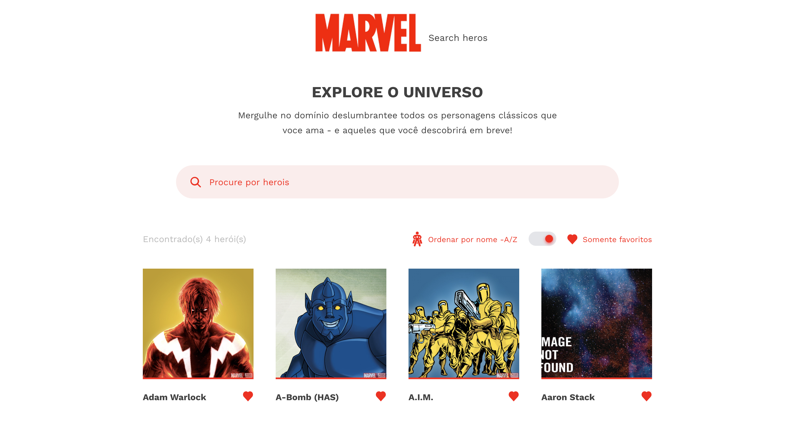

# Mavel Characters

<center>
  
<center>

## Sobre

Aplicação desenvolvida com o intuito de realizar a consulta dos persogens da Marvel. Utilizando a API ([https://developer.marvel.com/docs](https://developer.marvel.com/docs))

## Demonstração

[https://marvel-characters-gilt.vercel.app](https://marvel-characters-gilt.vercel.app)

## Tecnologias utilizadas

- [React](https://pt-br.reactjs.org/)
- [Typescript](https://www.typescriptlang.org/)
- [Styled components](https://styled-components.com/)
- [Jest](https://jestjs.io/)
- [Cypress](https://www.cypress.io/)
- [Testing Library](https://testing-library.com/docs/react-testing-library/intro)

## Execução

Tenha instalado em sua maquina o [Git](http://git-scm.com/) e [Node.js](http://nodejs.org/) 10.0.0 (ou superior). Caso prefira, instale o [Yarn](https://yarnpkg.com/).

1. Fork este repositório e crie um novo branch — ou crie um novo branch caso tenha permissão.

2. Depois de obter sua cópia local, acesse a pasta da aplicação e instale suas dependências:

```sh
npm install
```

ou

```sh
yarn
```

3. Acessa a API da Marvel [https://developer.marvel.com/docs](https://developer.marvel.com/docs) e crie uma conta para obter sua `private key` e `public key`

4. Crie o arquivo `.env.development` e `env.production`, com as variáveis e seus valores. Siga o exemplo `.env.example`

5. Para iniciar a aplicação em desenvolvimento, execute o comando abaixo:

```sh
npm start
```

ou

```sh
yarn start
```

## Testes

Todos os arquivos de testes terminam com `.spec.tsx` ou `.spec.ts`

### Unitários

Acesse o diretório da aplicação e use comando abaixo para executar os testes:

```sh
npm test
```

ou

```sh
npm run test:cov
```

ou

```sh
yarn test
```

ou

```sh
yarn test:cov
```

### E2E

Acesse o diretório da aplicação e use comando abaixo para executar os testes:

```sh
npm start
npm run cypress
```

ou

```sh
yarn start
yarn cypress
```

## Licença

[MIT](https://opensource.org/licenses/MIT)
